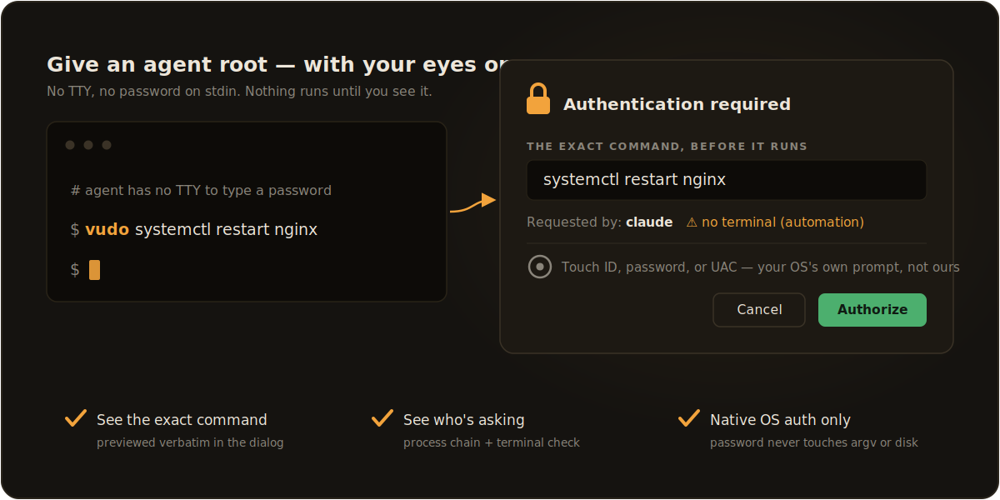

<p align="center">
  <picture>
    <source media="(prefers-color-scheme: dark)" srcset="assets/wordmark-dark.svg">
    
  </picture>
</p>

Run a command as root with a graphical prompt that **previews the exact
command** before you authorize it. A single dependency-free binary for Linux,
macOS, and Windows.

Built for contexts with no TTY to type a password into — an AI coding agent, a
hotkey, a `!` shell escape. Instead of a terminal prompt, `vudo` pops your OS's
native auth prompt showing what will run.

<p align="center">
  
</p>

```
vudo <command> [args...]
```

## Install

**Linux / macOS — one line:**

```sh
curl -fsSL https://raw.githubusercontent.com/elleryfamilia/vudo/main/install.sh | sh
```

This downloads the prebuilt binary for your platform from the latest
[release][releases page], verifies its SHA-256 checksum, and installs it to
`~/.local/bin` (override with `VUDO_INSTALL_DIR`). Prefer to read before you
pipe to a shell? The script is [install.sh](install.sh).

**From source** (any platform with a Rust toolchain):

```sh
cargo install --git https://github.com/elleryfamilia/vudo
```

**Windows — one line** (PowerShell):

```powershell
irm https://raw.githubusercontent.com/elleryfamilia/vudo/main/install.ps1 | iex
```

Downloads the latest release, verifies its SHA-256, installs to
`%LOCALAPPDATA%\Programs\vudo`, and adds it to your user `PATH`.

## Updating

```sh
vudo --update
```

Replaces the running binary in place with the latest release for your platform
(SHA-256 verified), on all platforms. `vudo --version` prints the current
version.

## Examples

```sh
vudo pacman -Syu
vudo systemctl restart nginx
vudo rm -rf /var/tmp/junk
```

Everything after `vudo` is the command run as root. A few options are reserved
when they come first: `--help`, `--version`, `--update`.

## How it works

`vudo` doesn't implement its own password field — it delegates authentication
to each OS's native agent, which is more secure and familiar:

| Platform | Mechanism |
|----------|-----------|
| Linux    | `sudo -A` with an askpass helper backed by **zenity → kdialog → pinentry** |
| macOS    | `sudo` via **Touch ID** (`pam_tid`) when configured, else an **osascript** password dialog |
| Windows  | **UAC** via PowerShell `Start-Process -Verb RunAs`, with the preview shown as a message box first |

On Unix it uses `sudo -A` (askpass) rather than `sudo -S` (password on stdin),
so the command's stdin/tty stay free — interactive root commands like
`pacman -Syu` ("Proceed? [Y/n]") still work. The password goes from the dialog
straight to sudo; it never touches argv, the environment, disk, or a log.

**Every command is authorized on its own.** By default vudo does not ride
sudo's cached credential timestamp: it clears the timestamp before and after
each run, so approving one command never grants a silent pass to the next. You
authorize (dialog or Touch ID) every single time — which is the whole point
when the caller might be an automation or agent. A side effect: a plain `sudo`
you run in a terminal will also re-prompt after a `vudo` command, since the
shared timestamp was cleared.

If you want the convenience of a cache window, pass `-c` / `--cache`:

```sh
vudo --cache pacman -Syu
```

With `--cache`, vudo simply stops clearing the timestamp and leaves sudo's own
caching in place. Whether a later command then skips the prompt is entirely
sudo's call — governed by its normal rules, i.e. its per-terminal timestamp and
`timestamp_timeout`. In a regular terminal that means repeated commands within
the window won't re-prompt; in a context with no controlling terminal (e.g. an
agent) sudo may not share the timestamp, so each command still prompts. To
change the window length, set `timestamp_timeout` in `sudoers`. `--cache` has
no effect on Windows, where UAC prompts for every elevation regardless.

The dialog also shows a **Requested by:** line so you can see where a root
prompt originated before authorizing it. It names the nearest ancestor process
that isn't a shell or pass-through wrapper (`timeout`, `env`, `sudo`, …) — your
terminal (e.g. `cosmic-term`) when you run it yourself, or the tool that
launched it (e.g. `claude`) otherwise. It also flags whether the caller had a
controlling terminal — `interactive terminal` (a human at a keyboard) vs.
`⚠ no terminal (automation)`. The name is best-effort; the terminal flag is a
reliable signal even when the name isn't.

**Notes**

- Linux: install `zenity` (or `kdialog`) for the most reliable dialog; pinentry
  is a last-resort fallback and can be flaky under some compositors.
- Windows: UAC shows its own consent prompt and runs the command in a separate
  elevated process, so the command's output isn't captured — only its exit code
  is returned. The preview is a separate message box shown before UAC.

## Build & test

```sh
cargo build --release
cargo test            # offline: Assuan/pinentry parsing + quoting
```

CI builds and tests on Linux, macOS, and Windows.

## License

MIT

[releases page]: https://github.com/elleryfamilia/vudo/releases
